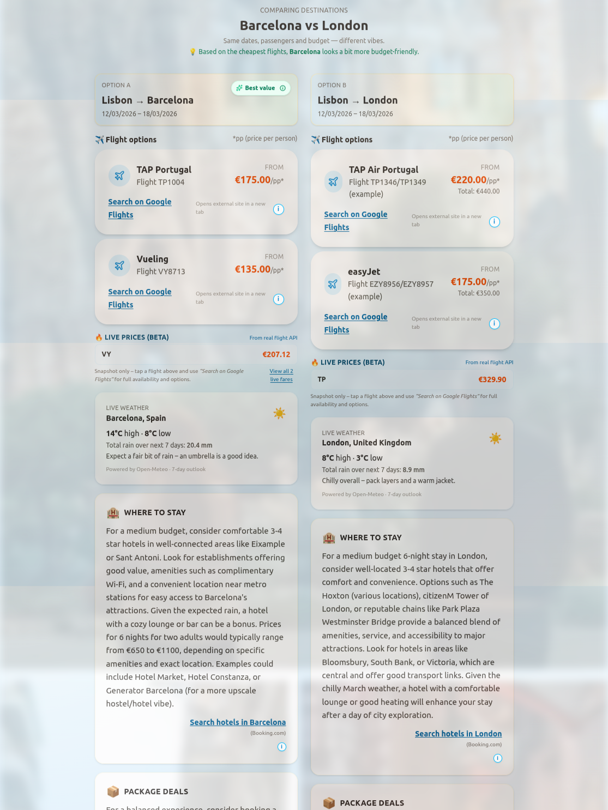

# Holiday Planner 🧳🏖️

**AI-powered holiday planning web app** that helps you compare destinations, see real flight prices, get weather-aware travel tips and preview your trip with generated images.

- 🌐 Live demo (frontend): https://claytoncrispim.github.io/holiday-planner-app/  
- 🔌 Live backend (Render): https://holiday-planner-app.onrender.com

> Built as a portfolio project to practice modern React, UI design, and Node.js API integration.

---
## 📷 Screenshot

---
## ✨ Features

### 1. Smart trip planner

- Origin, destination and **optional “Compare with”** field.
- Date pickers for departure/return dates.
- Traveller selector with age groups:
  - Adults, Young adults, Children, Infants
- Budget level toggle: **Budget · Balanced · Comfort**  
- Currency selector with **full world currency list** (USD, EUR, BRL, etc.) powered by a local data file.

### 2. AI travel guide (Gemini)

For each search, the backend calls **Google Gemini** to generate a structured guide, including:

- ✈️ Flight recommendations & typical prices
- 🛏️ Where to stay (areas, hotel types, tips)
- 🎟️ Package deals vs DIY
- 💡 “What’s the best option?” summary
- 📝 Optional comparison story if two destinations are provided

All content is rendered in friendly cards with a soft, brochure-style layout.

### 3. Destination comparison view

When a **comparison destination** is filled:

- The page switches into a **side-by-side “Option A vs Option B” layout**.
- Each column shows:
  - Flight options (AI-generated)
  - Live prices (beta)
  - Where to stay
  - Package deals
  - Best-option card
- A **“Best value” pill** highlights which destination looks more budget-friendly based on the cheapest flight.

### 4. Real flight prices (beta)

- The backend integrates with **Amadeus test APIs** to fetch real fares.
- Destinations are resolved to airports via `/resolve-airports` using fuzzy matching and a small override list (e.g. *Lisbon → LIS, Dublin → DUB*).
- Each destination column shows:
  - A **top live price row** (grouped per airline).
  - A **“View all X live fares”** link that opens a modal listing unique offers.
  - Everything clearly labelled as *snapshot only*.

### 5. Deep links to real booking tools

- Each flight card includes a **“Search on Google Flights”** link.
- Links are built with a helper to pre-fill route, dates and passenger count as best as possible.
- Hotel / package cards also contain outbound links like **“Search hotels in {destination}”** or **“Search package holidays”** for a real meta-search feel.

### 6. Live weather integration

- Uses **Open-Meteo** to fetch a 7-day forecast for each destination.
- Shows:
  - High / low temperature
  - Total rain over next 7 days
  - A short, human-readable summary (e.g. *“Warm and mostly dry – great beach or pool weather.”*)
- Weather is fetched **before** calling Gemini so the AI text can reference real conditions.

### 7. Generated imagery (Imagen)

- For the primary destination, the backend calls **Google Imagen** to generate:
  - A large “Visual trip preview” image.
  - A soft, blurred **page background** using the same image with high transparency.
- Images are streamed back as base64 PNG and rendered via a dedicated `GeneratedImageCard` component.

*(There’s an ongoing design goal to ensure prompts explicitly request diverse, non-stereotyped travellers.)*

### 8. Saved trips & “Change trip”

- Users can **save** interesting trips to localStorage using “Save this trip”.
- A **Saved trips panel** lets you re-load or delete stored itineraries.
- A compact **Trip summary bar** at the top shows current route, dates and travellers, with a “Change trip” link back to the planner.

### 9. Polished brochure-style UI

- Built with **React + Vite + Tailwind CSS**.
- Soft gradients, rounded cards, and micro-interactions:
  - Hover states on cards
  - Fade-in animations on key sections
  - Helpful tooltips (e.g. “How the live prices work”, “How Google Flights links are built”)
- Responsive layout designed for **desktop and mobile**.
- Gentle Imagen background on the whole page when a guide is loaded.

---

## 🧱 Tech Stack

**Frontend**

- React (Vite)
- Tailwind CSS
- Custom components (Search form, Passenger selector, Currency selector, Trip summary bar, Tooltips, etc.)

**Backend**

- Node.js + Express
- Google Gemini API (text)
- Google Imagen API (images)
- Amadeus (test) APIs – flight offers
- Open-Meteo – weather forecasts

**Deployment**

- **Frontend**: GitHub Pages (via GitHub Actions workflow)
- **Backend**: Render (Node web service)
- Environment variables used for secrets and base URLs.

---

## 🗺️ Architecture

```text
root
├── backend/
│   ├── server.js              # Express app & REST endpoints
│   ├── utils/
│   │   ├── resolveToIATA.js   # Fuzzy place → airport IATA resolution + overrides
│   │   ├── fetchWeatherForecast.js
│   │   ├── getAmadeusToken.js
│   │   └── isNumber.js
│   └── package.json
│
└── frontend/
    ├── src/
    │   ├── App.jsx
    │   ├── components/
    │   │   ├── SearchForm.jsx
    │   │   ├── PassengerSelector.jsx
    │   │   ├── CurrencySelector.jsx
    │   │   ├── DestinationGuideColumn.jsx
    │   │   ├── FlightCard.jsx
    │   │   ├── InfoSectionCard.jsx
    │   │   ├── InfoToolTip.jsx
    │   │   ├── GeneratedImageCard.jsx
    │   │   └── SavedTripsPanel.jsx
    │   ├── utils/
    │   │   └── buildGoogleFlightsUrl.js
    │   └── index.css
    └── package.json
```
**Key endpoints (backend)**

- `POST /generate-guide` – calls Gemini to generate the structured travel guide.

- `POST /generate-image` – calls Imagen for the hero image.

- `GET /weather?destination={city}` – Open-Meteo forecast wrapper.

- `GET /resolve-airports?origin=...&destination=...&compare=...` – resolves place names to IATA codes.

- `GET /real-flights?origin=XXX&destination=YYY&departureDate=YYYY-MM-DD&returnDate=YYYY-MM-DD&adults=N` – gets live flight offers from Amadeus.

---
## 🚀 Getting Started (local dev)
### 1. Clone the repo
```bash
git clone https://github.com/YOUR_USERNAME/holiday-planner-app.git
cd holiday-planner-app
```

### 2. Backend setup (`backend/`)
```bash
cd backend
npm install
```
Create a `.env` file in `backend/`:
```bash
GOOGLE_API_KEY=your_gemini_api_key
GOOGLE_SERVICE_ACCOUNT_JSON='{"type":"service_account", ...}'  # or point to a file if you prefer

AMADEUS_API_KEY=your_amadeus_key
AMADEUS_API_SECRET=your_amadeus_secret

# Optional: change if not running on 8080
PORT=8080
```

Then run:
```bash
npm start        # or: node server.js / npm run dev (depending on your scripts)
```

The backend should be available at `http://localhost:8080`.

### 3. Frontend setup (`frontend/`)
```bash
cd ../frontend
npm install
```

Create a `.env` file in `frontend/`:
```bash
VITE_API_BASE_URL=http://localhost:8080
```

The run:
```bash
npm run dev
```

Open the printed local URL (usually `http://localhost:5173`) in your browser.

---
## 📦 Deployment notes
### Backend (Render)

- Root directory: `backend`
- Build command: `npm install`
- Start command: `node server.js` (or `npm start`)
- Environment variables:
  - `GOOGLE_API_KEY`
  - `GOOGLE_SERVICE_ACCOUNT_JSON`
  - `AMADEUS_API_KEY`
  - `AMADEUS_API_SECRET`

### Frontend (GitHub Pages)

- Built with `npm run build` in `/frontend`.
- Deploys via a GitHub Actions workflow (`deploy-frontend.yml`) that:
  - Installs dependencies
  - Builds the app
  - Pushes the static files to `gh-pages` branch

Uses `VITE_API_BASE_URL` pointing to the Render backend URL.

---

### 🧪 Interesting implementation details

  - Retry logic around backend calls (with graceful user-facing error messages) to handle Render “cold starts”.
  - Weather-first flow: weather is fetched and summarised before the Gemini call so the AI content is grounded in real data.
  - **Airport resolution:**
    - Uses Amadeus locations API as primary source when available.
    - Falls back to fuzzy matching and a small override map to fix ambiguous place names.

- **Live prices deduplication:**
  - Flight offers are grouped by airline + price.
  - UI shows the cheapest unique fare as the headline, with a modal to see all unique fares.

---
### 🖼️ AI images, diversity and safety

Holiday Planner uses **Google Imagen** to generate destination preview images, but the app does **not** send Imagen whatever Gemini suggests by default.

Instead, the frontend builds Imagen prompts through a dedicated helper (`buildImagePrompt`) with a few explicit rules:

- **Minors-safe behaviour**
  - The app inspects the passenger breakdown (adults, young adults, children, infants).
  - If the group includes minors, the image prompt:
    - Focuses mainly on the **destination scenery** (streets, coastline, landmarks, nature).
    - Allows only generic **adult** travellers in the distance.
    - Explicitly instructs the model **not** to depict or mention “children, kids, minors, teens or infants”.
- **Consistent diversity**
  - When it’s safe to show people (adults only), prompts always ask for a **mix of skin tones and ethnic backgrounds** (Black, Brown, White, East Asian, South Asian, and mixed-race), presented positively and naturally.
  - No single person is the “hero” of the image; the group shares the scene.
- **No visual link between budget and appearance**
  - Budget level (Budget / Balanced / Comfort) affects how Gemini describes flights and hotels, but **not** how travellers look.
  - Prompts explicitly avoid linking appearance to wealth, status or comfort.
- **Anti-stereotype guidance**
  - Prompts ask for candid, documentary-style travel photography with:
    - No exaggerated luxury props
    - No brand logos or text
    - No stereotyped depictions of any group

Even with these safeguards, AI-generated images can still be imperfect or biased, so this logic is designed as a **deliberate mitigation layer**, not a guarantee. The goal is to make the visual side of Holiday Planner more inclusive and less stereotyped while still feeling aspirational and fun to use.

---
### 🔮 Roadmap / ideas

Some ideas I might explore next:
  - ✈️ **Typeahead airport picker** with autocomplete (like real airline sites).

  - 🌍 **Stronger diversity controls** in image prompts to avoid biased traveller depictions.

  - 🧩 Accessibility pass (keyboard navigation, aria-labels, contrast checks).

  - 📱 Offline / PWA support for saving trips & guides.

  - 🗣️ i18n for multiple languages and date formats.

  - 🔗 More real APIs (hotel search, packages) for even richer meta-search behaviour.

  ---
## 🙋 About the author

This project was designed and built by **Clayton Crispim** as a hands-on way to:

  - Practice **React + Node** in a realistic full-stack scenario.

  - Work with **AI APIs** (Gemini, Imagen) and real-world data (flights, weather).

  - Design a cohesive, production-style UI from scratch.

I’m actively looking for **Junior / Entry-level Frontend or Full-stack roles**.
If you’d like to chat, feel free to reach out via GitHub issues or my profile.

---

## 📄 License

This project is currently shared for portfolio and learning purposes.
If you’d like to reuse part of it, please open an issue or contact me first.

---
## 🏗️ How I would extend this in a production setting

If this were a real product, I would:

- Replace the Amadeus test APIs with a **paid production tier** or a dedicated flight meta-search partner, adding caching to reduce latency and cost.
- Introduce a proper **airport autocomplete component** backed by a searchable airport database (Algolia / Elastic / Supabase) instead of fuzzy matching city names.
- Add **user accounts** so trips, preferences and favourite destinations are synced across devices instead of only using localStorage.
- Perform an **accessibility pass** (WCAG): keyboard navigation, ARIA roles, focus management for modals and high-contrast themes.
- Move secrets and config to a **central config service** or secret manager (e.g. GCP Secret Manager) and add observability (logs, metrics, alerts).
- Improve image prompting and/or model choice to **explicitly enforce diverse, non-stereotyped travellers** and regularly review outputs for bias.
- Introduce an e2e testing layer (Playwright/Cypress) to cover critical flows like “search → compare → save trip → open live fares”.
